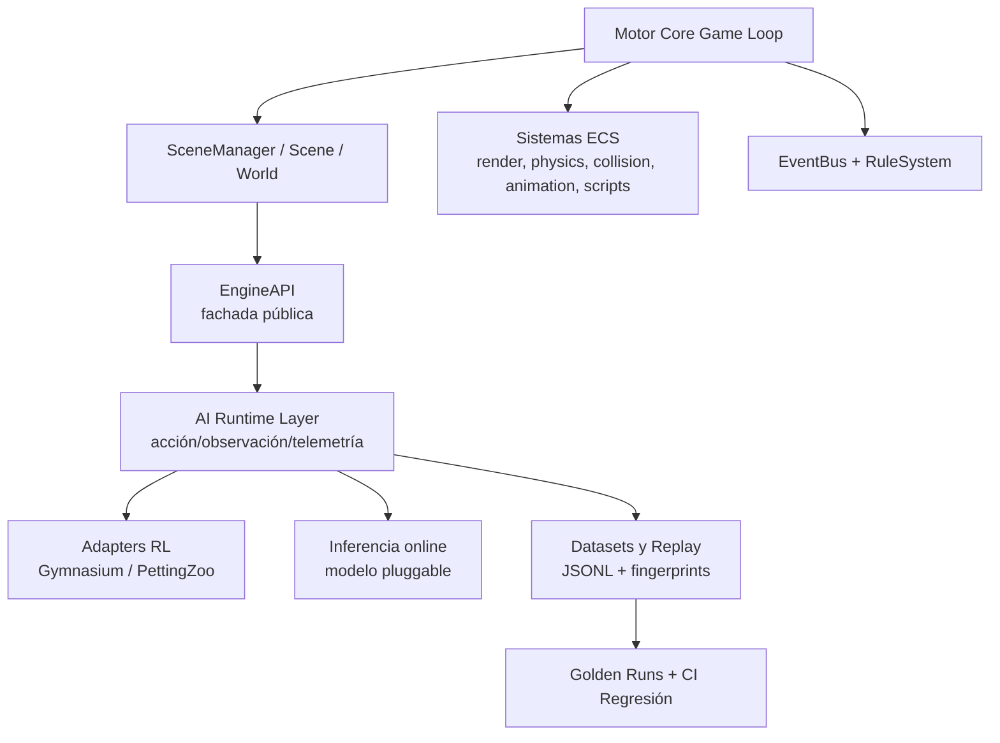

# Informe analítico de errores, seguridad, deuda técnica y evolución IA-friendly para MotorVideojuegosIA

## Resumen ejecutivo

**Conectores habilitados (y usados como fuente primaria):** entity["company","GitHub","code hosting platform"].

El repositorio implementa un **motor/editor 2D “IA First” en Python**, con arquitectura ECS, escenas JSON, modo GUI y modo headless/CLI, además de una **API pública (`EngineAPI`)** y herramientas para automatización, datasets y reproducibilidad. Esto está documentado explícitamente en el README y en `docs/TECHNICAL.md`. fileciteturn78file0 fileciteturn102file0 fileciteturn103file0

Los principales resultados del análisis son:

- **Riesgo legal/licenciamiento (alto):** el repositorio no incluye un archivo `LICENSE` estándar y el README solo indica “Proyecto académico - Universidad”, lo que (en términos prácticos de OSS) deja el uso/redistribución en una zona gris y bloquea adopción externa/colaboración. fileciteturn78file0 citeturn5search0turn5search2  
- **Fragilidad en wrappers RL (alto):** los entornos RL (`MotorGymEnv`, `MotorParallelEnv`) dependen de atributos privados del runtime (`_input_system`), rompiendo encapsulación y aumentando coste de mantenimiento. fileciteturn85file0 fileciteturn86file0  
- **Portabilidad de tests (medio):** varios tests usan `os.system("py -3 ...")` (acoplado al launcher de Python en Windows) y `sys.path.append(os.getcwd())`; esto dificulta CI multiplataforma y diagnósticos. fileciteturn87file0 fileciteturn88file0 fileciteturn89file0  
- **Seguridad por diseño (medio/alto):** existe una terminal embebida que lanza `powershell.exe ... -ExecutionPolicy Bypass` (riesgo de seguridad/compliance en entornos restrictivos), y hay resolución/lectura de rutas que, si en un futuro se expone remotamente la API, podría facilitar “path traversal”. fileciteturn84file0 fileciteturn82file0 fileciteturn83file0 citeturn6search3turn5search3  
- **Fortalezas IA-friendly ya presentes:** trazas reproducibles con huellas (`world_fingerprint`) + comparador de “golden runs”; dataset/replay con eventos; CLI útil para paralelizar ejecuciones con `sys.executable`. fileciteturn91file0 fileciteturn92file0 fileciteturn90file0 fileciteturn100file0  

Recomendación estratégica: **consolidar un “contrato público IA”** en `EngineAPI` para acciones/observaciones/telemetría (sin tocar internals), endurecer seguridad/portabilidad y después ampliar la capa IA (inferencias/modelos, evaluación, pipelines de dataset).

## Alcance, conectores y stack detectado

**Alcance:** revisión estática del código fuente y documentación del repositorio, orientada a localizar bugs, vulnerabilidades, malas prácticas y oportunidades IA-friendly; no se ha ejecutado el motor localmente (entorno de despliegue/hardware: **no especificado**, estimaciones aproximadas).

**Lenguajes detectados:**  
- **Python** (motor, editor, herramientas, tests). Evidente por estructura y archivos (`main.py`, `engine/`, `tools/`, `tests/`). fileciteturn78file0 fileciteturn81file0  
- **JSON** (escenas/levels, datasets `.jsonl`). fileciteturn78file0 fileciteturn90file0  

**Frameworks/librerías (observadas en repo):**
- **raylib-py / pyray** (render/GUI): aparece en `requirements.txt` y en imports del motor/editor. fileciteturn80file0 fileciteturn81file0 fileciteturn84file0  
- **Box2D (pybox2d)** como backend opcional de física (import protegido por `try/except`). fileciteturn93file0  
- **Pillow (PIL)** como dependencia opcional para métricas de fuente en la terminal. fileciteturn84file0  
- **Gymnasium** como dependencia opcional para API RL (wrapper de compat). fileciteturn97file0 citeturn4search1  
- **PettingZoo** como dependencia opcional multiagente (wrapper de compat). fileciteturn98file0 citeturn4search0  

**Entorno de despliegue:** **no especificado**.  
**Restricciones de hardware:** **no especificado**.

## Hallazgos priorizados

Criterios: severidad (crítico/alto/medio/bajo), esfuerzo (horas/días, aprox.) y beneficio (alto/medio/bajo). La “severidad” combina impacto técnico + probabilidad + superficie de mantenimiento.

| Hallazgo | Severidad | Esfuerzo | Beneficio | Evidencia | Nota técnica |
|---|---|---:|---|---|---|
| Ausencia de licencia OSS detectable (solo “Proyecto académico - Universidad” en README) | Alto | 1–3 h | Alto | fileciteturn78file0 citeturn5search0turn5search5 | Sin `LICENSE` estándar, por defecto aplican derechos reservados; dificulta contribuciones y reutilización legítima. citeturn5search2 |
| RL: acoplamiento a internals (`_input_system`) en `MotorGymEnv.step()` | Alto | 0.5–2 días | Alto | fileciteturn85file0 | Rompe encapsulación; cambios internos del motor rompen entrenamiento/datasets. |
| RL: acoplamiento a internals (`_input_system`) en `MotorParallelEnv.step()` | Alto | 0.5–2 días | Alto | fileciteturn86file0 | Igual problema, multiplicado por multiagente. |
| `main.py` crea `RuleSystem(event_bus, None)` aunque el constructor exige `World` | Medio | 2–8 h | Medio | fileciteturn81file0 fileciteturn95file0 | Puede explotar en runtime si se ejecutan reglas antes de `set_world`. |
| `main.py`: duplicaciones (import y `set_rule_system` repetido) | Bajo | 0.5–1 h | Bajo | fileciteturn81file0 | Deuda técnica, reduce legibilidad y aumenta ruido. |
| Excepciones silenciadas al activar Box2D (GUI y `EngineAPI`) | Medio | 2–6 h | Medio | fileciteturn81file0 fileciteturn82file0 | Oculta fallos reales (instalación/compatibilidad) y complica soporte. |
| Tests: uso de `os.system("py -3 ...")` (Windows-specific) | Medio | 0.5–1 día | Alto | fileciteturn87file0 fileciteturn88file0 fileciteturn89file0 | En Linux/macOS suele fallar (`py` no existe). Mejor usar `sys.executable` y `subprocess.run`. citeturn3search1turn3search2 |
| Tools/tests: `sys.path.append(os.getcwd())` | Medio | 0.5–2 días | Alto | fileciteturn87file0 fileciteturn99file0 fileciteturn101file0 | Indica packaging débil; complica imports y CI. |
| Terminal embebida: PowerShell con `-ExecutionPolicy Bypass` | Alto | 0.5–1 día | Medio | fileciteturn84file0 citeturn6search3 | “Bypass” evita bloqueos/avisos de política; es delicado en escenarios corporativos/seguridad. |
| Riesgo de “path traversal” si `EngineAPI` se expone remotamente: `resolve_path()` + `open(resolved_path)` | Medio | 1–2 días | Alto (si hay exposición remota) | fileciteturn82file0 fileciteturn83file0 citeturn5search3 | Hoy, el riesgo es “latente”: en local puede ser aceptable; si mañana hay HTTP/socket, conviene “sandbox”/jail de rutas. |
| Box2D: `freeze_x & freeze_y` → `body.fixedRotation=True` (mismatch semántico) | Medio | 1–3 días | Medio | fileciteturn93file0 fileciteturn94file0 | “FreezePositionX/Y” no equivale a “FreezeRotation”. Puede introducir comportamiento físico incorrecto. |
| `replay_episode()` carga todo el JSONL en memoria (datasets grandes) | Bajo/Medio | 0.5–1 día | Medio | fileciteturn90file0 | En entrenamiento a escala, conviene streaming/índices. |

## Mejoras propuestas

### Consolidación de arquitectura y encapsulación

**Objetivo:** que la capa IA/RL no dependa de internals del motor.

1) **Introducir un contrato público IA para inyección de acciones** (y observación): en vez de `env._api.game._input_system.inject_state(...)`, exponer un método explícito en `EngineAPI` (ej. `inject_input_state(...)`) y que RL se apoye en eso. Hoy mismo el objetivo declarado de `EngineAPI` es “controlar el motor y editar el contenido sin usar internals”, pero los wrappers RL lo hacen. fileciteturn82file0 fileciteturn85file0 fileciteturn86file0  
2) **Versionar `action_spec`/`observation_spec` como contrato estable**: ya están versionados (constantes `ACTION_SPEC_VERSION`, `OBSERVATION_SPEC_VERSION`) y devueltos en `info`. Fortalecerlo documentando compatibilidad y “breaking changes” (CHANGELOG). fileciteturn85file0 fileciteturn87file0  
3) **Refactorizar `RuleSystem` para `Optional[World]` o forzar creación tardía**: en `main.py` se pasa `None`, pero `RuleSystem` asume `World`. O bien (a) `RuleSystem` acepta `World | None` y no ejecuta acciones si no hay `World`, o bien (b) se instancia al entrar en PLAY cuando exista `RuntimeWorld`. fileciteturn81file0 fileciteturn95file0  

### Portabilidad, tooling y calidad

1) **Sustituir `os.system("py -3 ...")` por `subprocess.run([sys.executable, ...], check=True, capture_output=True, text=True)`**. Esto alinea con documentación oficial de `subprocess.run` y hace el runner multiplataforma. fileciteturn87file0 fileciteturn88file0 fileciteturn89file0 citeturn3search1turn3search2  
2) **Introducir un layout instalable** (`pyproject.toml` + `pip install -e .`) para eliminar `sys.path.append(os.getcwd())`. Hoy tanto tools como tests lo usan, señal de packaging inmaduro. fileciteturn87file0 fileciteturn99file0 fileciteturn101file0  
3) **Añadir lint/typecheck/security básicos**:
   - `ruff` para lint/format (rápido, configurable por `pyproject.toml`). citeturn8search0turn8search4  
   - `mypy` para tipado gradual (especialmente útil en `EngineAPI`, RL y serialización). citeturn8search5  
   - `bandit` para patrones inseguros frecuentes en Python. citeturn7search0  
   - `pip-audit` para vulnerabilidades en dependencias. citeturn7search1  

### Seguridad por diseño

**Situación actual:** hay superficie “potencialmente peligrosa” si se amplía el proyecto en el futuro (API remota, plugins de terceros, etc.).

1) **Terminal embebida**: cambiar el default a un modo más seguro y configurable:
   - Hoy se lanza `powershell.exe -NoLogo -NoProfile -ExecutionPolicy Bypass`. fileciteturn84file0  
   - `Bypass` está diseñado para escenarios donde PowerShell se integra en una app mayor con su propio modelo de seguridad, pero elimina bloqueos/avisos de política; por defecto no es ideal. citeturn6search3  
   Recomendación: `-ExecutionPolicy RemoteSigned` (o directamente sin forzar policy) y un setting explícito para permitir “Bypass” solo si el usuario lo habilita. citeturn6search3  
2) **Rutas y lectura de archivos**: hoy `ProjectService.resolve_path()` resuelve paths relativos contra `project_root` pero si el path está fuera, `to_relative_path()` puede devolver absoluto; y `EngineAPI.load_level()` hace `open(resolved_path)` si `load_scene_by_path` falla. fileciteturn83file0 fileciteturn82file0  
   Si en el futuro se recibe input externo, esto encaja con el patrón de CWE‑22 (“Path Traversal”): construir un pathname y no limitarlo adecuadamente a un directorio permitido. citeturn5search3  
   Recomendación: introducir un **modo sandbox** (opt-in) en `EngineAPI` para que toda lectura/escritura quede “enjaulada” dentro de `project_root` cuando el caller sea IA/automatización.  

### Rendimiento y reproducibilidad

1) **Reproducibilidad como función de CI**: el repositorio ya tiene `world_fingerprint` y `golden_run` (hash determinista del estado serializado y comparador). Integrarlo como “regresión oficial” en CI (golden runs con seeds fijas). fileciteturn91file0 fileciteturn92file0  
2) **Escalado de datasets**: `replay_episode()` lee el JSONL entero en memoria; para datasets grandes conviene streaming/índices por episodio. fileciteturn90file0  

## Funcionalidades IA-friendly propuestas

### Diseño técnico: una capa “IA Runtime” estable

**Dolor actual:** el motor dispone de `EngineAPI`, pero RL/datasets aún tocan internals (`_input_system`, `_event_bus`), y la telemetría queda mezclada con heurísticas en `scenario_dataset`. fileciteturn82file0 fileciteturn85file0 fileciteturn90file0

**Propuesta:** crear `engine/ai_runtime/` (o `engine/ai/`) como capa de integración que:
- expone **acción/observación** por API pública (sin internals),
- genera **telemetría** consistente (JSONL) con esquemas versionados,
- soporta **inferencia en tiempo real** (modelo pluggable),
- ofrece **herramientas de evaluación** (benchmarks, métricas, regresión).

#### APIs sugeridas (orientativas)

1) Acciones:
- `EngineAPI.inject_input_state(entity_name: str, state: dict[str, float], frames: int = 1) -> ActionResult`
- `EngineAPI.apply_action(agent_id: str, action: int | dict[str, Any]) -> ActionResult`

2) Observaciones:
- `EngineAPI.get_observation(agent_id: str, spec: str = "default") -> dict[str, Any]`
- `EngineAPI.get_state_fingerprint(float_precision: int = 6) -> dict[str, Any]` (delegando en `world_fingerprint`). fileciteturn91file0  

3) Telemetría:
- `EngineAPI.get_recent_events(count: int = 50) -> list[dict]` (sin acceder a `_event_bus` desde outside). Hoy `EventBus` ya implementa `get_recent_events`. fileciteturn96file0  

Con esto, los wrappers RL pueden cumplir el contrato Gymnasium/PettingZoo sin depender de internals, alineándose con las APIs oficiales: `Gymnasium.Env.step()` devuelve `(obs, reward, terminated, truncated, info)` y `reset()` devuelve `(obs, info)`. citeturn4search1  
Para multiagente en paralelo, PettingZoo define que `ParallelEnv.step(actions)` devuelve diccionarios `observations, rewards, terminations, truncations, infos`. citeturn4search0  

### Pipelines de entrenamiento y evaluación

**Entrenamiento (no acoplado a un framework concreto):**
- Estandarizar un comando CLI: `tools/train_rl.py` (nuevo) que:
  - ejecute rollouts,
  - guarde datasets JSONL,
  - exporte métricas (por episodio, reward breakdown, throughput),
  - permita “headless” y “parallel shards”.

El repo ya tiene un runner paralelo (`tools/parallel_rollout_runner.py`) que lanza `scenario_dataset_cli.py` con `sys.executable`, una base sólida multiplataforma. fileciteturn100file0 fileciteturn101file0  

**Evaluación y regresión:**
- Añadir `tools/eval.py` (nuevo) que:
  - reejecute seeds predefinidas,
  - compare `final_world_hash` con baseline,
  - falle en CI si hay divergencia (exceptuando cambios intencionales).  
Esto aprovecha `compare_golden_runs`. fileciteturn92file0  

### Arquitectura propuesta (alto nivel)



## Roadmap, prompts y plantillas

### Roadmap secuencial (dependencias + estimación)

| Fase | Tarea | Dependencias | Resultado/DoD | Estimación (aprox.) |
|---|---|---|---|---:|
| Licencia y gobernanza | Añadir `LICENSE` OSS + `CONTRIBUTING.md` + `SECURITY.md` | Ninguna | Repo “contribuible” con términos claros | 0.5–1 día |
| Encapsulación RL | Añadir `EngineAPI.inject_input_state` / `get_recent_events` y migrar Gym/PZ a usar API pública | Diseño API | RL no usa `_input_system` / `_event_bus` | 2–5 días |
| Portabilidad tests | Reemplazar `os.system("py -3 ...")` por `subprocess.run(sys.executable, ...)` | Ninguna | Tests pueden ejecutarse en Linux/macOS/Windows | 1–2 días |
| Packaging | `pyproject.toml` + `pip install -e .` + eliminar `sys.path.append(os.getcwd())` | Portabilidad tests (recomendado) | Imports limpios; mejor DX/CI | 2–4 días |
| Seguridad terminal | Hacer configurable ejecución sin `ExecutionPolicy Bypass` por defecto | Licencia/Docs | “Secure by default” | 1–2 días |
| Seguridad rutas | Modo sandbox en `EngineAPI` (opt-in) | Encapsulación RL | Minimiza riesgo CWE‑22 si se expone API | 1–3 días |
| Física Box2D | Arreglar semántica de constraints (FreezePosition vs fixedRotation) + tests | Observabilidad | Comportamiento coherente y testeado | 2–4 días |
| Evaluación/CI | Integrar golden runs y fingerprints en CI + reportes | Packaging | Regresión reproducible automatizada | 1–3 días |
| IA avanzada | AI Runtime Layer + telemetría estándar + inferencia pluggable | Encapsulación RL | Base para entrenamiento/inferencia/evaluación | 3–10 días |

### Prompts profesionales por tarea/PR/issue/commit

A continuación incluyo prompts “copiables” para abrir issues/PRs o guiar a un agente IA/desarrollador. Están ordenados por dependencias y prioridad.

#### Prompt para Issue/PR: Licencia OSS y archivos de comunidad

**Título sugerido:** “Añadir licencia OSS detectable y archivos de contribución”

**Prompt (Issue):**
> Objetivo: convertir el repositorio en legalmente reutilizable/colaborable.  
> Contexto: el README indica “Proyecto académico - Universidad” y no existe un `LICENSE` estándar. fileciteturn78file0  
> Tareas:
> - Añadir `LICENSE` (elegir MIT/Apache-2.0/GPL-3.0 según intención). Referencia: documentación oficial sobre licencias y detección. citeturn5search0turn5search5turn5search6  
> - Crear `CONTRIBUTING.md`: flujo local, estilo, tests, convenciones.  
> - Crear `SECURITY.md`: política de divulgación.  
> Criterios de aceptación:
> - GitHub detecta la licencia y se muestra en el repo. citeturn5search5  
> - README actualizado con la licencia elegida y alcance de uso.
> Riesgos: selección incorrecta de licencia (confirmar objetivo del autor).

**Comandos git (para el cambio):**
```bash
git checkout -b chore/license-and-community
# editar/añadir LICENSE, CONTRIBUTING.md, SECURITY.md
git add LICENSE CONTRIBUTING.md SECURITY.md README.md
git commit -m "chore: add OSS license and contribution/security docs"
git push -u origin chore/license-and-community
```

#### Prompt para PR: Encapsular inyección de acciones y eventos en EngineAPI (desacoplar RL)

**Título sugerido:** “IA/RL: exponer inyección de input y eventos vía EngineAPI; eliminar dependencia de internals”

**Prompt (PR):**
> Objetivo: que `MotorGymEnv` y `MotorParallelEnv` no accedan a `game._input_system`. Actualmente `step()` lanza `self._api.game._input_system.inject_state(...)`. fileciteturn85file0 fileciteturn86file0  
> Diseño:
> - Añadir `EngineAPI.inject_input_state(entity_name, state, frames)` y usarlo desde ambos entornos.  
> - Añadir `EngineAPI.get_recent_events(count)` apoyado en `EventBus.get_recent_events`. fileciteturn96file0  
> - Mantener compatibilidad con el contrato de Gymnasium/PettingZoo. Referencias oficiales: `Env.step/reset` y Parallel API. citeturn4search1turn4search0  
> Criterios de aceptación:
> - Búsqueda en repo: no hay usos de `_input_system` fuera del core del motor.  
> - `tests/test_gym_env.py` y `tests/test_pettingzoo_env.py` pasan. fileciteturn87file0 fileciteturn88file0  
> - Se documenta el contrato de acción/observación (`action_spec_version`, `observation_spec_version`). fileciteturn85file0  
> Notas:
> - Evitar romper `tools/random_rollout_dataset.py` que construye `MotorGymEnv`. fileciteturn99file0

**Comandos git:**
```bash
git checkout -b feat/engineapi-input-injection
git add engine/api/engine_api.py engine/rl/gym_env.py engine/rl/pettingzoo_env.py tests/
git commit -m "feat(ai): add EngineAPI input injection and decouple RL envs from internals"
git push -u origin feat/engineapi-input-injection
```

#### Prompt para Issue/PR: Portar tests a multiplataforma y eliminar “py -3”

**Prompt (Issue):**
> Problema: los tests ejecutan scripts con `os.system("py -3 ...")`, lo que acopla a Windows. fileciteturn87file0 fileciteturn88file0 fileciteturn89file0  
> Objetivo: usar `subprocess.run` + `sys.executable`, capturando output y fallando con `check=True`. Referencia oficial: `subprocess.run` y `sys.executable`. citeturn3search1turn3search2  
> Criterios de aceptación:
> - Tests funcionan en Windows/Linux/macOS.  
> - Si el subprocess falla, se ve stderr en el output de test.

**Comandos git:**
```bash
git checkout -b test/cross-platform-runner
git add tests/test_*.py
git commit -m "test: make dataset script tests portable using subprocess and sys.executable"
git push -u origin test/cross-platform-runner
```

#### Prompt para PR: Modo seguro por defecto en terminal embebida

**Prompt (PR):**
> Contexto: `terminal_panel.py` lanza PowerShell con `-ExecutionPolicy Bypass`. fileciteturn84file0  
> Riesgo: la documentación oficial define `Bypass` como que no se bloquea nada ni hay avisos, pensado para integraciones con modelo de seguridad propio. citeturn6search3  
> Objetivo: “secure by default”:
> - No forzar `Bypass` por defecto (o hacerlo opt-in por setting).  
> - Añadir setting en `project_settings.json` (p.ej. `terminal.execution_policy: "RemoteSigned"|"Bypass"|""`).  
> - Mostrar en UI el modo activo.  
> Criterios de aceptación:
> - En ausencia de setting, se usa el modo más seguro razonable.  
> - Documentación en `docs/TECHNICAL.md` o README.
> Nota: la terminal solo funciona en Windows según el propio código. fileciteturn84file0

**Comandos git:**
```bash
git checkout -b security/terminal-defaults
git add engine/editor/terminal_panel.py engine/project/project_service.py docs/TECHNICAL.md
git commit -m "security: make embedded terminal execution policy configurable and safer by default"
git push -u origin security/terminal-defaults
```

### Plantillas recomendadas (PR e Issue)

**.github/pull_request_template.md**
```md
## Objetivo
Describe el “qué” y el “por qué”.

## Contexto
- Issue/bug relacionado:
- Archivos principales tocados:

## Cambios realizados
- [ ] Cambio 1
- [ ] Cambio 2

## Cómo probar
Comandos exactos:
- `python -m unittest -q`
- (otros)

## Riesgos / compatibilidad
- Impactos potenciales:
- Migraciones necesarias:

## Checklist
- [ ] Tests pasan
- [ ] No se accede a internals desde RL/API (si aplica)
- [ ] Documentación actualizada
```

**.github/ISSUE_TEMPLATE/bug_report.md**
```md
---
name: Bug report
about: Reporta un fallo reproducible
---

## Descripción
¿Qué falla?

## Pasos para reproducir
1.
2.

## Resultado esperado
...

## Resultado actual
...

## Entorno
- OS:
- Python:
- Modo: GUI / headless

## Logs / Capturas
Pega logs relevantes.
```

**.github/ISSUE_TEMPLATE/feature_request.md**
```md
---
name: Feature request
about: Proponer mejora o funcionalidad IA-friendly
---

## Objetivo
¿Qué problema resuelve?

## Propuesta
Describe API/UX/arquitectura.

## Impacto IA-friendly
¿Mejora entrenamiento? ¿inferencia? ¿evaluación? ¿automatización?

## Criterios de aceptación
- [ ]
- [ ]
```

## Snippets, comandos, pruebas y fuentes

### Parches concretos sugeridos

#### Arreglo mínimo: `RuleSystem` y `World` opcional en arranque

Problema: `main.py` crea `RuleSystem(event_bus, None)` pero `RuleSystem` requiere `World`. fileciteturn81file0 fileciteturn95file0

**Opción A (robusta):** permitir `World | None` y no ejecutar acciones sin world.

```diff
diff --git a/engine/events/rule_system.py b/engine/events/rule_system.py
--- a/engine/events/rule_system.py
+++ b/engine/events/rule_system.py
@@
-class RuleSystem:
+class RuleSystem:
@@
-    def __init__(self, event_bus: EventBus, world: World) -> None:
+    def __init__(self, event_bus: EventBus, world: World | None) -> None:
@@
-        self._world = world
+        self._world = world
@@
     def _action_destroy_entity(self, params: Dict[str, Any]) -> None:
+        if self._world is None:
+            return
         ...
```

#### Portabilidad tests: `os.system("py -3 ...")` → `subprocess.run(sys.executable, ...)`

Motivo: `py -3` es Windows-specific. fileciteturn87file0 citeturn3search1turn3search2

```diff
diff --git a/tests/test_gym_env.py b/tests/test_gym_env.py
--- a/tests/test_gym_env.py
+++ b/tests/test_gym_env.py
@@
-import os
+import subprocess
@@
-            exit_code = os.system(
-                f'py -3 tools/random_rollout_dataset.py ...'
-            )
-            self.assertEqual(exit_code, 0)
+            subprocess.run(
+                [sys.executable, "tools/random_rollout_dataset.py", "levels/platformer_test_scene.json",
+                 "--episodes", "2", "--max-steps", "8", "--seed", "90", "--out", output_path.as_posix()],
+                check=True, capture_output=True, text=True
+            )
```

### Pruebas recomendadas

**Unitarias (rápidas)**
- API estable:
  - `EngineAPI.inject_input_state` (nuevo): inyección de input sin tocar internals.
  - `EngineAPI.get_recent_events`: debe devolver lista serializable (max N).  
  (Se apoya en `EventBus.get_recent_events`). fileciteturn96file0  
- ECS:
  - `World.get_entity_by_component_instance` con componentes reales (para jerarquía). fileciteturn105file0  

**Integración**
- RL wrappers:
  - Contrato Gymnasium: `reset()` devuelve `(obs, info)` y `step()` devuelve `(obs, reward, terminated, truncated, info)`. citeturn4search1turn4search6  
  - Contrato PettingZoo parallel: `reset()` y `step(actions)` con diccionarios por agente. citeturn4search0  
- Datasets:
  - `scenario_dataset_cli.py run-episodes` + `replay-episode` debe ser reproducible (ya existe test). fileciteturn101file0 fileciteturn89file0  

**Benchmarks**
- Throughput en headless:
  - ya existe `tools/parallel_rollout_runner.py` con métrica `throughput_steps_per_second`. Ampliar con perfiles por backend de física (legacy vs box2d). fileciteturn100file0 fileciteturn82file0  

### Comandos recomendados (análisis estático, seguridad y tests)

**Tests actuales**
```bash
python -m unittest -q
```
(Actualmente los tests usan `unittest`.) fileciteturn87file0

**Validación/CLI de datasets y replay**
```bash
python tools/scenario_dataset_cli.py run-episodes levels/platformer_test_scene.json --episodes 2 --max-steps 50 --seed 77 --out out/episodes.jsonl --summary-out out/summary.json
python tools/scenario_dataset_cli.py replay-episode out/episodes.jsonl --episode-id episode_0000
```
fileciteturn101file0 fileciteturn90file0

**Lint / typing / security (recomendados tras añadir `pyproject.toml` y deps dev)**
```bash
python -m pip install -U ruff mypy bandit pip-audit pytest
ruff check .
mypy engine
bandit -r engine -q
pip-audit -r requirements.txt
pytest -q
```
Razonamiento y fuentes oficiales de herramientas: Ruff (comando `ruff check`). citeturn8search0turn8search4  
Bandit (análisis de issues comunes de seguridad en Python). citeturn7search0  
pip-audit (auditoría de vulnerabilidades en dependencias). citeturn7search1  
pytest (framework de testing). citeturn8search1  

### Fuentes consultadas

**Repositorio (fuente primaria, vía conector):**
- README (objetivos IA-first, estructura, dependencias declaradas, licencia “académica”). fileciteturn78file0  
- `requirements.txt` (dependencias mínimas). fileciteturn80file0  
- `main.py` (wiring de sistemas, `RuleSystem(None)`, silent except Box2D). fileciteturn81file0  
- `engine/api/engine_api.py` (fachada, load_level + resolve_path/open, silent except Box2D). fileciteturn82file0  
- RL wrappers y compat: `engine/rl/gym_env.py`, `engine/rl/pettingzoo_env.py`, `engine/rl/gym_compat.py`, `engine/rl/pettingzoo_compat.py`. fileciteturn85file0 fileciteturn86file0 fileciteturn97file0 fileciteturn98file0  
- Datasets/replay: `engine/rl/scenario_dataset.py`, `tools/scenario_dataset_cli.py`, `tools/parallel_rollout_runner.py`. fileciteturn90file0 fileciteturn101file0 fileciteturn100file0  
- Reproducibilidad: `engine/debug/state_fingerprint.py`, `engine/debug/golden_run.py`. fileciteturn91file0 fileciteturn92file0  
- Seguridad terminal: `engine/editor/terminal_panel.py`. fileciteturn84file0  
- Paths: `engine/project/project_service.py`. fileciteturn83file0  
- Física Box2D + constraints: `engine/physics/box2d_backend.py`, `engine/components/rigidbody.py`. fileciteturn93file0 fileciteturn94file0  
- Documentación técnica y análisis interno: `docs/TECHNICAL.md`, `docs/ANALISIS_PROYECTO_ACTUAL.md`. fileciteturn102file0 fileciteturn103file0  

**Fuentes externas oficiales (para contratos, seguridad y tooling):**
- Contrato Gymnasium `Env.step/reset` (terminated/truncated). citeturn4search1turn4search6  
- Contrato PettingZoo Parallel API. citeturn4search0  
- Documentación oficial de licencias en repositorios (cómo elegir y añadir). citeturn5search0turn5search5turn5search2  
- Políticas de ejecución de PowerShell (definición de `Bypass`). citeturn6search3  
- CWE‑22 Path Traversal (definición del patrón de riesgo). citeturn5search3  
- Documentación oficial de Python sobre `subprocess.run` y `sys.executable`. citeturn3search1turn3search2  
- Herramientas: Bandit, pip-audit, Ruff, pytest. citeturn7search0turn7search1turn8search0turn8search1